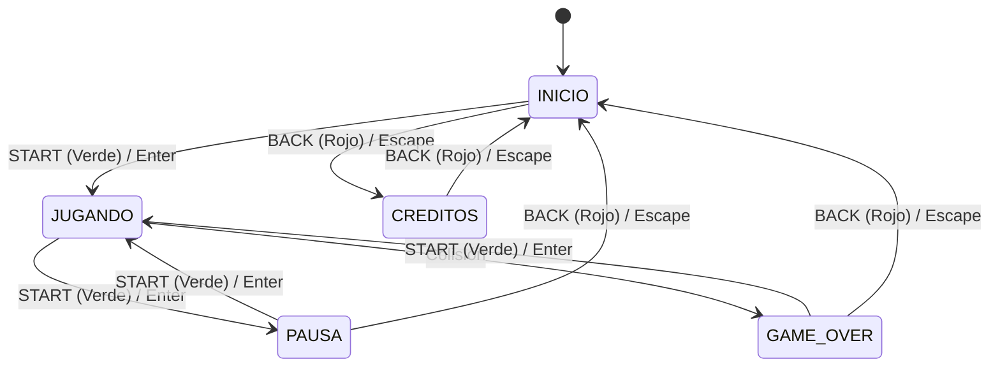

# 🎮 Snake Game - Consola Retro

Una versión mejorada del legendario juego de la serpiente, renderizada dentro de una **carcasa de consola retro** inspirada en el diseño icónico de la **Game Boy** y los teléfonos clásicos **Nokia**.

Desarrollado con **HTML5 Canvas**, **CSS3 moderno** y **JavaScript Vanilla** (sin dependencias ni librerías externas).

---

## ✨ Características Principales

- **Diseño de Consola Retro**: Carcasa detallada con biseles, marco de pantalla LCD verdoso, cruceta direccional (D-pad) y botones diagonales con iluminación retro.
- **Máquina de Estados Completa**:
  - `INICIO`: Pantalla de bienvenida interactiva con arte pixel y animación parpadeante.
  - `JUGANDO`: Bucle de juego optimizado a 60 ms con marcador en tiempo real.
  - `PAUSA`: Pausa instantánea manteniendo el estado actual de la partida.
  - `GAME OVER`: Resumen de puntuación final con opción de reintentar o volver al menú.
  - `CRÉDITOS`: Información técnica y autoría del proyecto.
- **Doble Esquema de Control**:
  - **Físico / Táctil**: Cruceta direccional y botones interactivos compatibles con pantallas táctiles (móviles/tablets) y clics de ratón.
  - **Teclado**: Flechas o teclas `W`, `A`, `S`, `D`, más `Enter`/`Espacio` y `Escape`.
- **Prevención de Suicidio / Auto-Giro**: Sistema de cola de entrada que impide colisiones accidentales al presionar giros rápidos contrarios.
- **Diseño 100% Responsivo**: Se adapta fluidamente a teléfonos móviles, tablets y monitores de escritorio.
- **Cero Dependencias**: Implementación pura en Vanilla JS sin jQuery ni librerías pesadas.

---

## 🕹️ Controles

| Acción | Botón en Consola | Teclado |
| :--- | :--- | :--- |
| **Mover Arriba** | Cruceta ▲ | `▲ Flecha Arriba` / `W` |
| **Mover Abajo** | Cruceta ▼ | `▼ Flecha Abajo` / `S` |
| **Mover Izquierda** | Cruceta ◀ | `◀ Flecha Izquierda` / `A` |
| **Mover Derecha** | Cruceta ▶ | `▶ Flecha Derecha` / `D` |
| **Iniciar / Pausar / Reintentar** | Botón Verde (`START`) | `Enter` / `Espacio` |
| **Volver / Salir / Créditos** | Botón Rojo (`BACK`) | `Escape` / `Backspace` |

---

## 🏗️ Flujo de Pantallas



---

## 🛠️ Tecnologías

- **HTML5**: Estructura semántica, accesibilidad ARIA y renderizado gráfico mediante `<canvas>` (450×450 píxeles nativos).
- **CSS3**: Diseño retro realista mediante degradados, sombras multicapa, CSS Grid para la cruceta y consultas de medios responsive.
- **JavaScript Vanilla**: Lógica de máquina de estados, manejo de eventos pointer (táctiles y mouse), gestión de colisiones y bucle de juego.
- **Google Fonts**: Tipografía pixelada estilo 8-bit (*Press Start 2P*).

---

## 🚀 Cómo Ejecutar

1. Clona o descarga el repositorio:
   ```bash
   git clone https://github.com/arkev/SnakeGame.git
   ```
2. Abre `index.html` en cualquier navegador web moderno (Chrome, Firefox, Safari, Edge) o utiliza un servidor local sencillo:
   ```bash
   npx serve .
   ```
3. ¡Disfruta la experiencia retro en tu ordenador o dispositivo móvil!

---

## 📁 Estructura del Proyecto

```text
SnakeGame/
├── index.html    # Estructura semántica de la consola, canvas y botones
├── style.css     # Estética visual Game Boy / Nokia, cruceta y responsive
├── script.js     # Máquina de estados, lógica de juego, canvas y controles
└── README.md     # Documentación completa del juego
```
