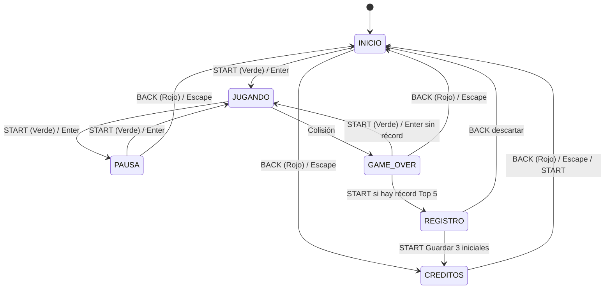

# 🎮 Snake Game - Consola Retro

Una versión mejorada del legendario juego de la serpiente, renderizada dentro de una **carcasa de consola retro** inspirada en el diseño icónico de la **Game Boy** y los teléfonos clásicos **Nokia**.

Desarrollado con **HTML5 Canvas**, **CSS3 moderno** y **JavaScript Vanilla** (sin dependencias ni librerías externas).

> 🌐 **Demo en Vivo / Versión Pública:**  
> Puedes jugar directamente desde tu navegador en **GitHub Pages**:  
> 👉 **[https://arkev.github.io/SnakeGame/](https://arkev.github.io/SnakeGame/)**  
>  
> *Nota: Esta rama (`gh-pages`) corresponde a la versión pública oficial lista para producción y alojada en GitHub Pages.*

---

## ✨ Características Principales

- **Diseño de Consola Retro**: Carcasa detallada con biseles, marco de pantalla LCD verdoso, cruceta direccional (D-pad), botones diagonales con iluminación retro y ranuras de altavoz.
- **Máquina de Estados Completa**:
  - `INICIO`: Pantalla de bienvenida con arte pixel, animación parpadeante y `HI` con el mejor récord local.
  - `JUGANDO`: Bucle de juego con velocidad progresiva y marcador `PUNTOS` en tiempo real.
  - `PAUSA`: Pausa instantánea manteniendo velocidad y estado de la partida.
  - `GAME_OVER`: Puntuación final, `TOP 5` local y acceso al registro si entraste al top.
  - `REGISTRO`: Captura de 3 iniciales con teclado virtual (sin scroll).
  - `CRÉDITOS`: Autoría del proyecto (Desarrollado por **Arkev**) + `TOP 5` con iniciales.
- **Velocidad Progresiva**:
  - Inicio en `150 ms` por paso (~6.67 pasos/s), es decir, 40% de la velocidad original de `60 ms`.
  - Cada 5 puntos: `+5%` de velocidad compuesta (`intervalo = 150 / 1.05^nivel`, `nivel = floor(puntos/5)`), sin tope.
  - La velocidad original (~60 ms) se alcanza alrededor del nivel 19 (95 puntos).
  - Cada partida reinicia a `150 ms`; pausar/reanudar conserva la velocidad.
- **Récords Locales sin Base de Datos (Top 5)**:
  - Guardado en `localStorage` (`snakegame_top5_v1`) como `[{nombre:"ABC", puntos:12}]`. Persiste por navegador/dispositivo.
  - Migra récords viejos en formato número a `{nombre:"---", puntos:N}`.
  - Solo entra si `puntos > 0` y supera al 5to lugar (el empate no desplaza).
- **Doble Esquema de Control**:
  - **Físico / Táctil**: Cruceta direccional y botones `START`/`BACK` compatibles con touch y mouse. En `REGISTRO`, D-pad ◀/▶ mueve el cursor.
  - **Teclado virtual**: A-Z + Ñ + ⌫ dentro de la pantalla, compacto y sin scroll, especial para celular.
  - **Teclado físico**: Flechas o `W`, `A`, `S`, `D`, más `Enter`/`Espacio` y `Escape`. En `REGISTRO`, letras/números escriben, `Backspace` borra, `Enter` guarda y `Escape` sale.
- **Audio Procedural 8-bit (Web Audio API, sin archivos)**:
  - SFX con motor ZzFX vendoreado (MIT Frank Force): `comer`, `nivel` (cada 5 pts), `choque`, `record`, `start`, `back`, `tecla`, `borrar`, `guardar`, `ui`. Sonido activado por defecto.
  - Música en loop con secuenciador propio (square lead + triangle bass): loop tranquilo en `INICIO/GAME_OVER/REGISTRO/CRÉDITOS`, loop movido en `JUGANDO`, pausa en `PAUSA`.
  - La música intenta arrancar desde el inicio; iOS/Android exigen un primer gesto (cualquier tap/tecla) y luego suena sola.
  - Botón Mute como switch (un clic apaga/enciende, sin mantener): icono Material Symbols Rounded `volume_up`/`volume_off`, persiste en `localStorage` (`snakegame_mute_v1`). Tecla `M` también alterna (fuera de `REGISTRO`).
- **Prevención de Suicidio / Auto-Giro**: Sistema de cola de entrada que impide colisiones accidentales al presionar giros rápidos contrarios.
- **Optimizado para Móviles y Web App**: 
  - Meta tags para pantalla completa (`apple-mobile-web-app-capable`).
  - Iconos personalizados y favicon en carpeta `images/`.
  - Prevención de zoom accidental, scroll y selección de texto.
- **Diseño 100% Responsivo**: Se adapta fluidamente a teléfonos móviles, tablets y monitores de escritorio.
- **Cero Dependencias**: Implementación pura en Vanilla JS sin jQuery ni librerías pesadas.

---

## 🕹️ Controles

| Acción | Botón en Consola | Teclado |
| :--- | :--- | :--- |
| **Mover Arriba** | Cruceta ▲ | `▲ Flecha Arriba` / `W` |
| **Mover Abajo** | Cruceta ▼ | `▼ Flecha Abajo` / `S` |
| **Mover Izquierda** | Cruceta ◀ | `◀ Flecha Izquierda` / `A` |
| **Mover Derecha** | Cruceta ▶ | `▶ Flecha Derecha` / `D` |
| **Iniciar / Pausar / Reanudar** | Botón Verde (`START`) | `Enter` / `Espacio` |
| **Reintentar (sin récord)** | Botón Verde (`START`) en `GAME_OVER` | `Enter` / `Espacio` |
| **Registrar récord** | Botón Verde (`START`) en `GAME_OVER` → `REGISTRO` | `Enter` en `GAME_OVER` |
| **Guardar iniciales** | `START: GUARDAR` (físico o en pantalla) | `Enter` (requiere 3 iniciales) |
| **Salir / Cancelar registro** | Botón Rojo (`BACK`, descarta sin guardar) | `Escape` (en `REGISTRO` también `Backspace` borra) |
| **Escribir iniciales** | Teclado virtual A-Z + Ñ + ⌫ (tocar letras/casillas) | Letras `A-Z`, `Ñ`, `0-9` |
| **Mover cursor (registro)** | Cruceta ◀ / ▶ | `◀` / `▶` |
| **Silenciar / Activar sonido** | Botón superior (switch, un clic) | `M` (fuera de `REGISTRO`) |
| **Volver / Salir / Créditos** | Botón Rojo (`BACK`) | `Escape` / `Backspace` (fuera de `REGISTRO`) |

---

## 🏗️ Flujo de Pantallas



> **Notas de flujo:** `BACK` en `REGISTRO` descarta las iniciales y no guarda. `START` en `REGISTRO` solo guarda con las 3 iniciales completas y muestra el `TOP 5` en `CRÉDITOS`.

---

## 🛠️ Tecnologías

- **HTML5**: Estructura semántica, accesibilidad ARIA, metaetiquetas para Web App móvil y renderizado gráfico mediante `<canvas>` (450×450 píxeles nativos).
- **CSS3**: Diseño retro realista mediante degradados, sombras multicapa, CSS Grid para la cruceta y consultas de medios responsive.
- **JavaScript Vanilla**: Lógica de máquina de estados (`INICIO/JUGANDO/PAUSA/GAME_OVER/REGISTRO/CREDITOS`), velocidad progresiva, récords en `localStorage`, teclado virtual, audio procedural (ZzFX + secuenciador), manejo de eventos pointer (táctiles y mouse), gestión de colisiones y bucle de juego.
- **Google Fonts**: Tipografía pixelada estilo 8-bit (*Press Start 2P*) + iconos (*Material Symbols Rounded* para Mute).
- **ZzFXMicro v1.4.0** (MIT, Frank Force): motor tiny vendoreado en `script.js` para SFX sin archivos.

---

## 🔊 Audio: cómo pegar tus sonidos

- **SFX**: diseña en [ZzFX Designer](https://killedbyapixel.github.io/ZzFX/) → Export TXT → en `script.js` busca `var SFX = {` y reemplaza solo el array de cada clave (`comer`, `nivel`, `choque`, `record`, `start`, `back`, `tecla`, `borrar`, `guardar`, `ui`). Con `[]` ese sonido queda mudo. Trae presets demo.
- **Música**: compone en [BeepBox](https://www.beepbox.co/) → en `script.js` busca `var MUSICA = {` y pega tus notas como `[["C5",1],["E5",1],["-",1]]` en `menuLead/menuBass` y `juegoLead/juegoBass`. Ajusta `pasoMenu/pasoJuego`. Trae melodías demo.

---

## 🏆 Récords

- El `TOP 5` vive solo en el navegador (`localStorage`, sin servidor).
- Formato: `[{ "nombre": "ABC", "puntos": 12 }]`.
- Limitaciones: no es global (cada celular/navegador tiene su top), se borra al limpiar datos del sitio y es editable desde DevTools.

---

## 🚀 Cómo Ejecutar

### En línea (Recomendado)
Accede directamente a la versión pública en:  
🔗 **[https://arkev.github.io/SnakeGame/](https://arkev.github.io/SnakeGame/)**

### Localmente
1. Clona o descarga el repositorio:
   ```bash
   git clone -b gh-pages https://github.com/arkev/SnakeGame.git
   ```
2. Abre `index.html` directamente en cualquier navegador web moderno (Chrome, Firefox, Safari, Edge) o utiliza un servidor local:
   ```bash
   # Opción con Python
   python3 -m http.server 8080

   # Opción con Node.js / npx
   npx serve .
   ```
3. ¡Disfruta la experiencia retro en tu ordenador o dispositivo móvil!

---

## 📁 Estructura del Proyecto

```text
SnakeGame/
├── images/
│   ├── consola.svg       # Arte vectorial original de la consola
│   ├── favicon.png       # Favicon del sitio
│   └── snakeGame.png     # Icono de la aplicación para dispositivos móviles
├── index.html            # Estructura de la consola, botón Mute, canvas, overlay de registro + teclado virtual, meta tags e iconos
├── style.css             # Estilos de la carcasa, pantalla, cruceta, registro compacto sin scroll, botón Mute y responsive
├── script.js             # Máquina de estados, velocidad progresiva, Top 5 localStorage, registro de iniciales, audio procedural (SFX+Música+Mute) y canvas
└── README.md             # Documentación completa del proyecto
```

---

## 👤 Autor

Desarrollado por **Arkev**.
